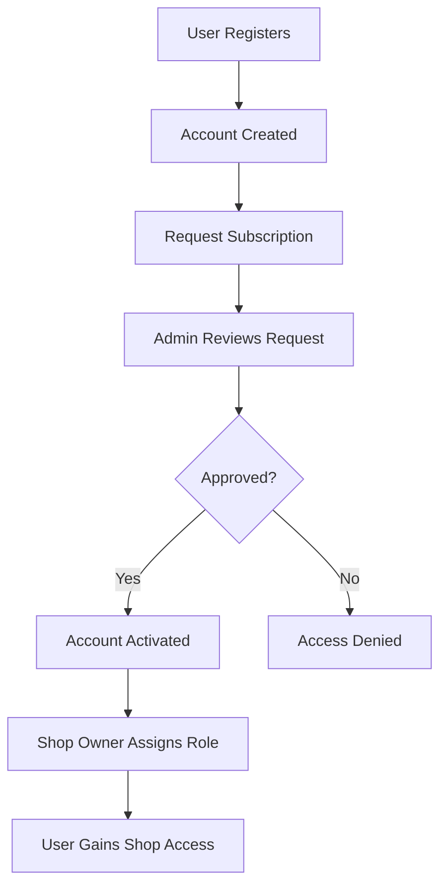
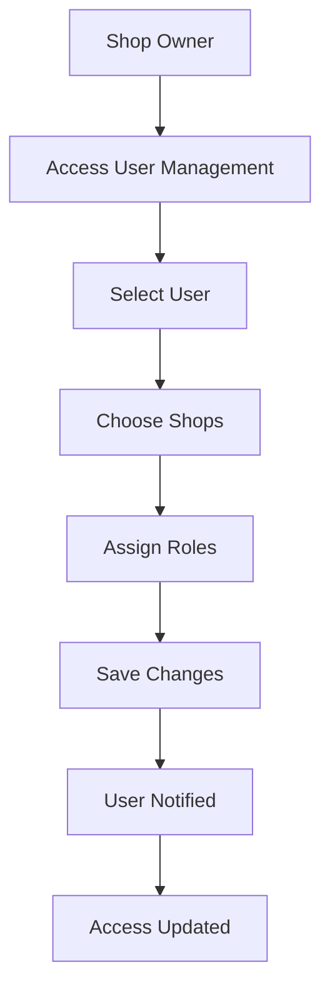

# 🔐 Roles and Permissions System Report
## MorningCricket Inventory Management System

---

## 📊 Executive Summary

The MorningCricket Inventory Management System implements a comprehensive multi-level authorization system with:
- **2 System-Level Roles**: Admin, Regular User
- **5 Shop-Level Roles**: Owner, Manager, Finance, Stock, Viewer
- **Role-Based Access Control (RBAC)** with Laravel Policies
- **Middleware-based Route Protection**
- **Multi-Shop Support** with per-shop role assignments

---

## 🏗️ System Architecture

### 1. **Database Structure**

```sql
-- Users Table
users (
    id, name, email, password, invitation_token, 
    last_login_at, is_subscribed, is_admin_approved
)

-- Shops Table  
shops (
    id, name, owner_id, created_at, updated_at
)

-- Shop-User Pivot Table
shop_users (
    id, shop_id, user_id, role, created_at, updated_at
)
```

### 2. **Role Hierarchy**

```
System Level:
├── Super Admin (admin role in any shop)
└── Regular User

Shop Level (per shop):
├── Owner (shop creator/owner)
├── Manager (deputy owner)
├── Finance (financial operations)
├── Stock (inventory operations)  
└── Viewer (read-only access)
```

---

## 👥 Detailed Role Definitions

### **System-Level Roles**

| Role | Description | Key Permissions |
|------|-------------|-----------------|
| **Super Admin** | System administrators with `admin` role in any shop | • Approve/reject subscriptions<br>• Access admin panel<br>• Bypass subscription requirements<br>• Full system access |
| **Regular User** | Standard users requiring subscription approval | • Must have active subscription<br>• Admin approval required<br>• Shop-level permissions only |

### **Shop-Level Roles**

| Role | Description | Key Responsibilities |
|------|-------------|---------------------|
| **Owner** | Shop creator and ultimate authority | • Full shop management<br>• User management<br>• Role assignments<br>• Shop deletion |
| **Manager** | Deputy with most permissions | • Daily operations<br>• Staff supervision<br>• Report access<br>• Product management |
| **Finance** | Financial operations specialist | • Sales entry<br>• Financial entries<br>• Payment tracking<br>• Financial reports |
| **Stock** | Inventory management specialist | • Product management<br>• Stock-in operations<br>• Daily stock checks<br>• Inventory reports |
| **Viewer** | Read-only access for reporting | • View data only<br>• Generate reports<br>• No modifications allowed |

---

## 🔐 Detailed Permission Matrix

### **CRUD Operations by Role**

| Resource | Action | Owner | Manager | Finance | Stock | Viewer | Admin |
|----------|--------|-------|---------|---------|-------|--------|-------|
| **Products** | Create | ✅ | ✅ | ❌ | ✅ | ❌ | ✅ |
| | Read | ✅ | ✅ | ✅ | ✅ | ✅ | ✅ |
| | Update | ✅ | ✅ | ❌ | ✅ | ❌ | ✅ |
| | Delete | ✅ | ✅ | ❌ | ❌ | ❌ | ✅ |
| **Stock-Ins** | Create | ✅ | ✅ | ❌ | ✅ | ❌ | ✅ |
| | Read | ✅ | ✅ | ✅ | ✅ | ✅ | ✅ |
| | Update | ✅ | ✅ | ❌ | ✅ | ❌ | ✅ |
| | Delete | ✅ | ✅ | ❌ | ❌ | ❌ | ✅ |
| **Daily Stock Checks** | Create | ✅ | ✅ | ❌ | ✅ | ❌ | ✅ |
| | Read | ✅ | ✅ | ✅ | ✅ | ✅ | ✅ |
| | Update | ✅ | ✅ | ❌ | ✅ | ❌ | ✅ |
| | Delete | ✅ | ✅ | ❌ | ❌ | ❌ | ✅ |
| **Sales** | Create | ✅ | ✅ | ✅ | ❌ | ❌ | ✅ |
| | Read | ✅ | ✅ | ✅ | ✅ | ✅ | ✅ |
| | Update | ✅ | ✅ | ✅ | ❌ | ❌ | ✅ |
| | Delete | ✅ | ✅ | ❌ | ❌ | ❌ | ✅ |
| **Financial Entries** | Create | ✅ | ✅ | ✅ | ❌ | ❌ | ✅ |
| | Read | ✅ | ✅ | ✅ | ❌ | ❌ | ✅ |
| | Update | ✅ | ✅ | ❌ | ❌ | ❌ | ✅ |
| | Delete | ✅ | ✅ | ❌ | ❌ | ❌ | ✅ |
| **Users** | Create | ✅ | ❌ | ❌ | ❌ | ❌ | ✅ |
| | Read | ✅ | ❌ | ❌ | ❌ | ❌ | ✅ |
| | Update | ✅ | ❌ | ❌ | ❌ | ❌ | ✅ |
| | Delete | ✅ | ❌ | ❌ | ❌ | ❌ | ✅ |
| **Shops** | Create | ✅ | ❌ | ❌ | ❌ | ❌ | ✅ |
| | Read | ✅ | ✅ | ✅ | ✅ | ✅ | ✅ |
| | Update | ✅ | ❌ | ❌ | ❌ | ❌ | ✅ |
| | Delete | ✅ | ❌ | ❌ | ❌ | ❌ | ✅ |

### **Feature Access Matrix**

| Feature | Owner | Manager | Finance | Stock | Viewer | Admin |
|---------|-------|---------|---------|-------|--------|-------|
| **Dashboard** | ✅ | ✅ | ✅ | ✅ | ✅ | ✅ |
| **Inventory Management** | ✅ | ✅ | ❌ | ✅ | 👁️ | ✅ |
| **Sales Processing** | ✅ | ✅ | ✅ | ❌ | 👁️ | ✅ |
| **Financial Management** | ✅ | ✅ | ✅ | ❌ | 👁️ | ✅ |
| **User Management** | ✅ | ❌ | ❌ | ❌ | ❌ | ✅ |
| **Role Assignment** | ✅ | ❌ | ❌ | ❌ | ❌ | ✅ |
| **Shop Settings** | ✅ | ❌ | ❌ | ❌ | ❌ | ✅ |
| **Reports (Stock)** | ✅ | ✅ | ❌ | ✅ | ✅ | ✅ |
| **Reports (Financial)** | ✅ | ✅ | ✅ | ❌ | ✅ | ✅ |
| **Reports (Customer Dues)** | ✅ | ✅ | ✅ | ❌ | ✅ | ✅ |
| **Data Export** | ✅ | ✅ | ✅ | ✅ | ✅ | ✅ |
| **Subscription Management** | ❌ | ❌ | ❌ | ❌ | ❌ | ✅ |

**Legend**: ✅ Full Access | 👁️ Read Only | ❌ No Access

---

## 🛡️ Security Implementation

### **1. Laravel Policies**

```php
// Policy Classes
├── UserPolicy.php          // User management authorization
├── ShopPolicy.php          // Shop access control  
├── ProductPolicy.php       // Product CRUD permissions
├── StockInPolicy.php       // Stock-in operations
├── SalePolicy.php          // Sales transaction control
├── FinancialEntryPolicy.php // Financial operations
└── DailyStockCheckPolicy.php // Inventory checks
```

### **2. Middleware Stack**

```php
// System Middleware
├── AdminMiddleware             // Super admin verification
├── SubscriptionMiddleware      // Subscription requirement
├── SubscriptionAdminMiddleware // Admin panel access
├── EnsureShopSelected         // Shop context requirement
├── CheckShopRole              // Role-based route protection
└── EnsureUserIsOwner          // Owner-only operations
```

### **3. Route Protection Levels**

```php
// Route Groups with Middleware
├── Guest Routes               // No authentication required
├── Authenticated Routes       // Basic login required
├── Subscribed Routes         // Active subscription + approval
├── Shop Context Routes       // Shop selection required
├── Role-Based Routes         // Specific role required
└── Admin Routes              // Super admin only
```

---

## 🔄 Role Assignment Workflow

### **1. User Registration Flow**



### **2. Role Management Process**



---

## 📁 File Structure

### **Core Authorization Files**

```
app/
├── Models/
│   ├── User.php                 // User model with role methods
│   ├── Shop.php                 // Shop model
│   └── ShopUser.php             // Pivot model for shop-user relationships
├── Policies/
│   ├── UserPolicy.php           // User management policies
│   ├── ShopPolicy.php           // Shop access policies
│   ├── ProductPolicy.php        // Product CRUD policies
│   ├── StockInPolicy.php        // Stock-in policies
│   ├── SalePolicy.php           // Sales policies
│   ├── FinancialEntryPolicy.php // Financial policies
│   └── DailyStockCheckPolicy.php // Stock check policies
├── Http/
│   ├── Middleware/
│   │   ├── AdminMiddleware.php              // Super admin check
│   │   ├── SubscriptionMiddleware.php       // Subscription validation
│   │   ├── SubscriptionAdminMiddleware.php  // Admin panel access
│   │   ├── EnsureShopSelected.php          // Shop context check
│   │   ├── CheckShopRole.php               // Role verification
│   │   └── EnsureUserIsOwner.php           // Owner verification
│   └── Controllers/
│       ├── UserController.php      // User & role management
│       ├── AdminController.php     // Subscription management
│       └── ShopController.php      // Shop management
├── Providers/
│   └── AuthServiceProvider.php     // Policy registration & gates
└── ...
```

---

## 🎯 Key Implementation Features

### **1. Multi-Shop Support**
- Users can belong to multiple shops with different roles
- Shop context maintained in session
- Role permissions evaluated per shop

### **2. Dynamic Role Checking**
- Real-time role verification using `hasRole()` and `hasAnyRole()`
- Shop-specific permission evaluation
- Session-based shop context

### **3. Subscription Management**
- Two-tier approval system (user request + admin approval)
- Subscription bypass for super admins
- Automatic access control based on subscription status

### **4. Security Best Practices**
- Policy-based authorization
- Middleware route protection
- CSRF protection
- SQL injection prevention through Eloquent

---

## 🔧 Configuration & Usage

### **1. Creating System Admin**

```bash
# Using Artisan Command
php artisan make:user:admin user@example.com --shop-id=1

# Programmatic Creation
$user = User::find(1);
ShopUser::create([
    'user_id' => $user->id,
    'shop_id' => 1,
    'role' => 'admin'
]);
```

### **2. Role Assignment**

```php
// Check user role
if ($user->hasRole('owner', $shopId)) {
    // Owner-specific logic
}

// Check multiple roles
if ($user->hasAnyRole(['owner', 'manager'], $shopId)) {
    // Manager+ level access
}

// Policy authorization
$this->authorize('update', $product);
```

### **3. Middleware Usage**

```php
// In routes/web.php
Route::middleware(['owner'])->group(function () {
    // Owner-only routes
});

Route::middleware(['manager'])->group(function () {
    // Manager+ level routes
});
```

---

## 📈 Access Patterns & Usage Statistics

### **Common Access Patterns**

1. **Daily Operations Staff** (Stock + Finance roles)
   - Product management and inventory updates
   - Sales processing and payment recording
   - Daily stock verification

2. **Management Team** (Owner + Manager roles)
   - Strategic oversight and reporting
   - User management and system configuration
   - Financial analysis and planning

3. **Reporting Users** (Viewer role)
   - Report generation and data analysis
   - Read-only access to historical data
   - Export functionality for external analysis

### **Security Considerations**

1. **Principle of Least Privilege**: Each role has minimum necessary permissions
2. **Separation of Duties**: Financial and inventory operations can be separated
3. **Audit Trail**: All operations logged with user context
4. **Session Management**: Shop context maintained securely
5. **Role Hierarchies**: Clear escalation paths for permissions

---

## 🚀 Recommendations

### **1. Security Enhancements**
- Implement role-based audit logging
- Add IP-based access restrictions
- Consider implementing role expiration dates
- Add two-factor authentication for sensitive roles

### **2. Usability Improvements**
- Role-based dashboard customization
- Contextual help based on user permissions
- Bulk role assignment capabilities
- Role templates for common configurations

### **3. Monitoring & Analytics**
- Track role usage patterns
- Monitor unauthorized access attempts
- Generate role effectiveness reports
- Alert on suspicious permission changes

---

## 📝 Conclusion

The MorningCricket Inventory Management System implements a robust, scalable role-based access control system that provides:

- **Granular Permissions**: Fine-grained control over feature access
- **Multi-Shop Support**: Flexible role assignments across multiple shops
- **Security First**: Policy-driven authorization with middleware protection
- **User Experience**: Intuitive role management with clear permission boundaries
- **Scalability**: Extensible design for future role additions

This system ensures data security, operational efficiency, and clear accountability while maintaining ease of use for end users.

---

*Generated on: 2025-06-10*  
*System Version: Laravel 11 with Custom RBAC Implementation*
